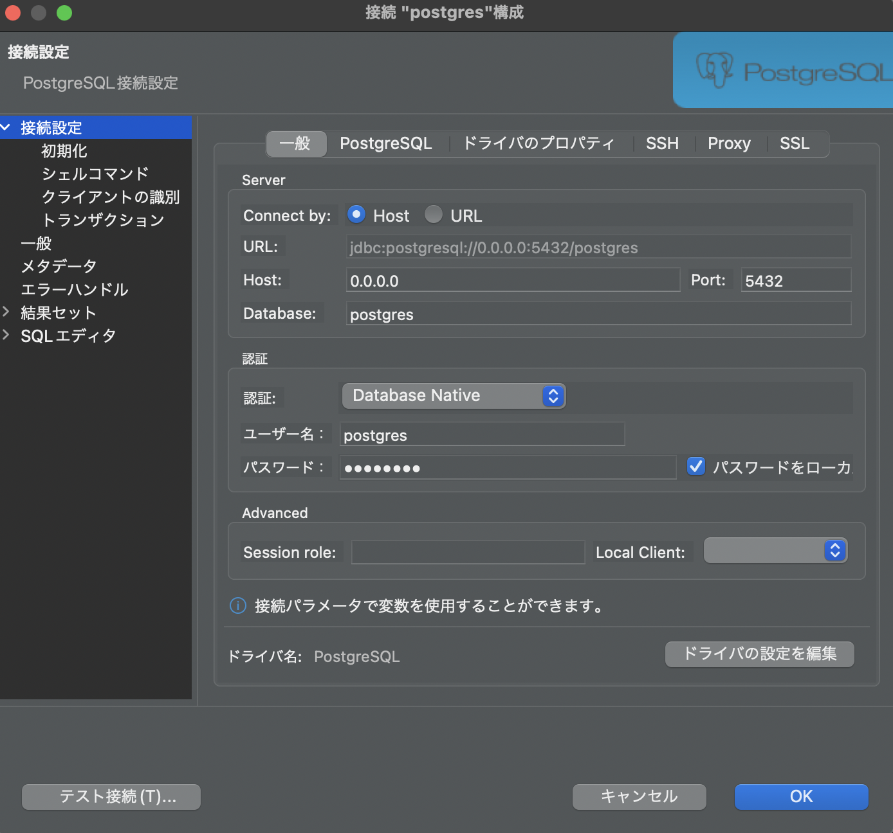

# DBUnitのサンプルリポジトリ

## 動作環境と使用したツール
- macOS Monterey 12.2.1、M1Mac
- IntelliJ
- Docker
- DBeaver
- DbUnit
- JUnit

# Dockerを利用したPostgreSQLの準備

## コンテナでSQLクエリを叩く
```bash
$ docker exec -it postgresql_container /bin/bash
 
psql -U postgres
select * from book;

# コンテナのpostgresqlから出る場合
\q
# コンテナから出る場合
exit
```

## DBeaverでPostgreSQLに接続
下記のように設定<br>
設定後は左下のテスト接続を押下しOKになることを確認

- Host：0.0.0.0
- Port: 5432(docker-compose.ymlの設定を参考)
- Database: postgres(docker-compose.ymlの設定を参考)
- ユーザー名：postgres(docker-compose.ymlの設定を参考)
- パスワード：(postgres(docker-compose.ymlの設定を記載)

 